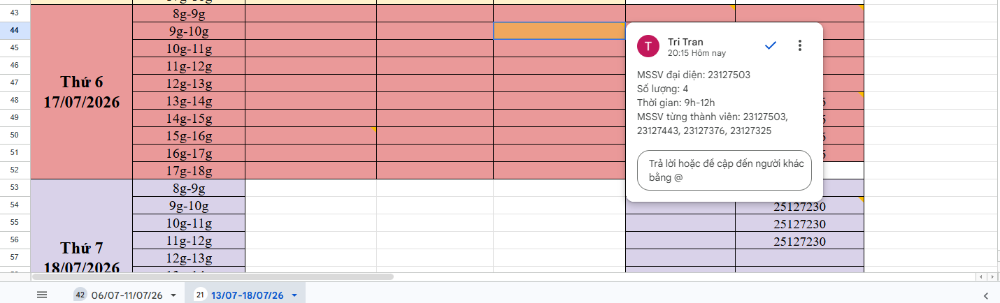

# Weekly Report

---

## General Information

| Item           | Information             |
| -------------- | ----------------------- |
| **Group ID**   | Group10                 |
| **Week**       | Week 05                 |
| **Date Range** | 13/07/2026 – 19/07/2026 |

---

# Tasks Completed This Week

## Member 1

**Student ID:** 23127325

**Full Name:** Lê Gia Bảo

### Completed Tasks

- Rehearsal seminar in library

### Evidence

- Library booking:
  

---

## Member 2

**Student ID:** 23127376

**Full Name:** Hồ Gia Huy

### Completed Tasks

- Rehearsal seminar in library

### Evidence

- Library booking:
  

---

## Member 3

**Student ID:** 23127443

**Full Name:** Trần Phạm Trọng Nhân

### Completed Tasks

- Rehearsal seminar in library

### Evidence

- Library booking:
  

---

## Member 4

**Student ID:** 23127503

**Full Name:** Trần Thanh Trí

### Completed Tasks

- Rehearsal seminar in library

### Evidence

- Library booking:
  

---

# AI Usage Declaration

## AI Tools Used

| AI Tool       | Purpose                                                                                                                            | Output                                                     |
| ------------- | ---------------------------------------------------------------------------------------------------------------------------------- | ---------------------------------------------------------- |
| Gemini (Chat) | Brainstorming interactive game ideas for the seminar, drafting slide content, and outlining the in-class activity flow             | Game concepts, slide drafts, activity script               |
| Claude (Chat) | Drafting and polishing seminar slides, expanding game ideas, and designing the Agent Skill workflow for `test_invariants_skill.md` | Slide content, game mechanics, `test_invariants_skill.md`  |
| Cursor        | Applying and validating the Agent Skill by generating invariant test files against the real MongoDB schema and running them        | `test_invariants_skill.md` execution, generated test files |

### Description

During this week, our group utilized AI tools in the following ways to support seminar preparation and the integrity-testing workflow:

- Used Gemini Chat mainly as a brainstorming partner for the seminar: generating ideas for interactive games suitable for a classroom setting, drafting initial slide content, and shaping the storyline of the in-class activity.
- Used Claude Chat to turn those raw ideas into polished deliverables — refining the seminar slides, elaborating the game mechanics (rules, scoring, answer-key strategy), and most importantly designing the Agent Skill workflow captured in `test_invariants_skill.md`, which encodes the standard procedure for generating NoSQL invariant tests (read real schema → place orphan-check in the referencing collection → run via `runAllInvariants.js` → self-checklist).
- Used Cursor IDE to operationalize that skill: invoking the Agent to apply `test_invariants_skill.md` against the real MongoDB schemas in our codebase, inspecting the generated invariant test files, and actually running them to verify the workflow behaves correctly before committing.
- All AI-generated content — game ideas, slide drafts, skill instructions, and test code — was reviewed, refined, and verified by group members before being adopted into the repository or the seminar materials.

### Note on Documentation Gaps

Due to time constraints this week, detailed logs (exact access timestamps, verbatim
prompts, and screenshots/chat history) for the AI tools listed above were not fully
recorded at the time of use.

We understand this does not fully satisfy the transparency requirements in Section 5
of the AI Usage Guidelines for this reporting period, and will supplement the missing
details in the Week 05 report.

---

# Tasks Planned for Next Week

- Build a lightweight web app to host the in-class activity (Spot-the-PII Game), including the CSV dataset display, cell-selection interaction, scoring logic, and answer-key coordinate validation
- Schedule and run a full presentation rehearsal to validate timing, slide flow, and the live demo of the in-class activity web app

---

# Issues

| Issue | Resolution | Status |
| ----- | ---------- | ------ |
| N/A   | N/A        | ---    |

---

# Notes (Optional)

None.
